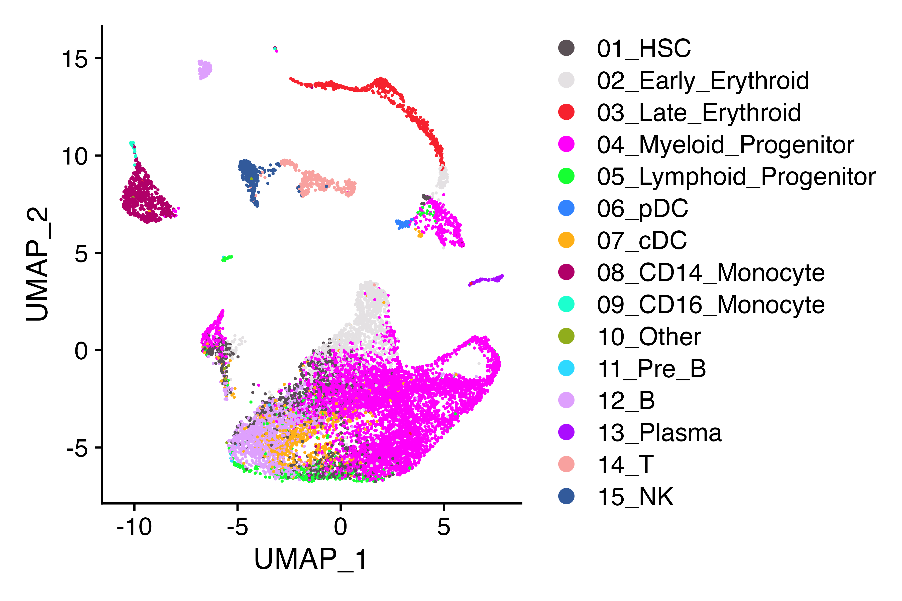
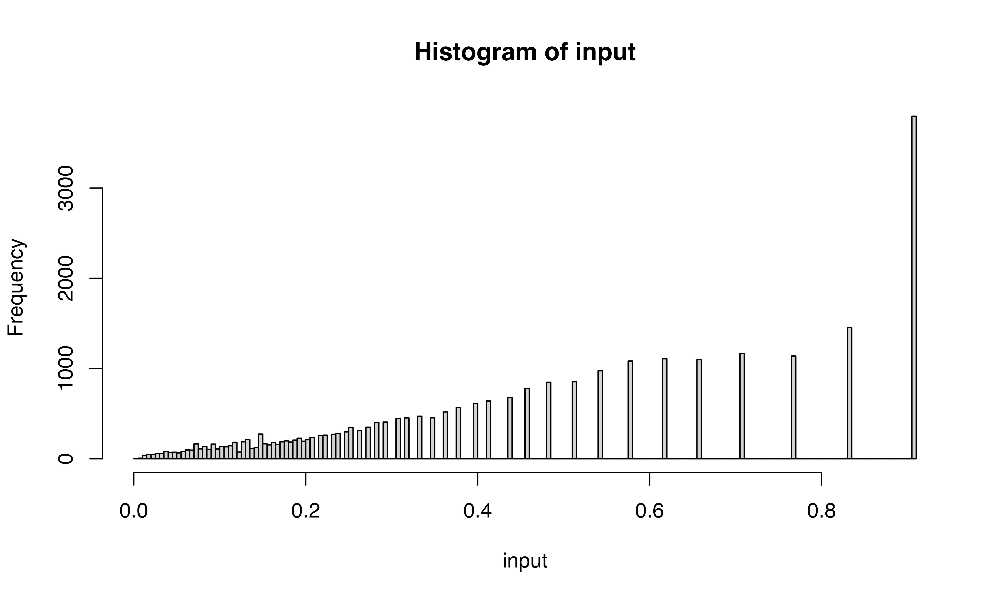

# Implementing Scrublet in R

## Installation of packages

Note that this notebook was run using Rstudio enabling both R and Python
environments to be maintained throughout.

#### Installing scrubletR

You will need to have the devtools package installed…

``` r

devtools::install_github("furlan-lab/scrubletR")
```

#### Loading reticulate

Not for the faint of heart… You can read about getting python working
from within R \[here\] (<https://rstudio.github.io/reticulate/>). You
can either activate your reticulate environment and use ‘pip install
scrublet’ to install scrublet or try from R as below. I use conda
(reluctantly) and could not get it to install from in R

``` r

library(reticulate)
py_config()
py_install("scrublet")
```

I had to do this in the terminal after creating a new conda environment
called ‘reticulate’.

``` bash
conda activate reticulate
pip install scrublet
```

Regardless of how you do it, you can check that it is installed using
this from R. If you are successful, you will get no output.

``` r

py_run_string("import scrublet")
```

Failure will look something like this

``` r

py_run_string("import scrubletoops")
```

``` bash
Error in py_run_string_impl(code, local, convert) : 
  ModuleNotFoundError: No module named 'scrubletoops'
Run `reticulate::py_last_error()` for details.
```

## Comparing Implementations

Ok with working R and python versions of Scrublet, let’s go over the
differences. First let’s load data

#### Load data

``` r

suppressPackageStartupMessages({
  library(viewmastR)
  library(Seurat)
  library(scCustomize)
  library(Matrix)
  library(ggplot2)
})

if(grepl("^gizmo", Sys.info()["nodename"])){
  ROOT_DIR2<-"/fh/fast/furlan_s/grp/data/ddata/BM_data"
} else {
  ROOT_DIR2<-"/Users/sfurlan/Library/CloudStorage/OneDrive-SharedLibraries-FredHutchinsonCancerCenter/Furlan_Lab - General/experiments/patient_marrows/aggr/cds/indy"
}

#query dataset
seuP<-readRDS(file.path(ROOT_DIR2, "220831_WC1.RDS"))
DimPlot_scCustom(seuP, label = F)
```



``` r

#counts_matrix<-t(seuP@assays$RNA@counts[,1:2000])
counts_matrix<-t(seuP@assays$RNA@counts)
```

### First step

The first step in scrublet data processing is size factor normalization.
Let’s see how the normalized counts compare across the two
implementations. In the next block, I have run the scrublet pipeline
through normalization and saved the counts in the R environment as
“py_E_obs_norm”

``` python

import numpy as np
import scrublet as scr
scrub = scr.Scrublet(r.counts_matrix)

##set params
synthetic_doublet_umi_subsampling=1.0
use_approx_neighbors=True
distance_metric='euclidean'
get_doublet_neighbor_parents=False
min_counts=3
min_cells=3
min_gene_variability_pctl=85
log_transform=False
mean_center=True,
normalize_variance=True
n_prin_comps=30
svd_solver='arpack'
verbose=True
random_state = 0

#clear data in object
scrub._E_sim = None
scrub._E_obs_norm = None
scrub._E_sim_norm = None
scrub._gene_filter = np.arange(scrub._E_obs.shape[1])

#run normalize
scr.pipeline_normalize(scrub)

#capture size factor normalized counts
r.py_E_obs_norm = scrub._E_obs_norm.data
```

#### Run scrubletR size factor normalization

To see how the sets of counts compare, we can similarly run scrubletR
normalization and correlate a sample (n=5000) of the log transformed
counts using ggplot. Unsurprisingly they are not different.

``` r

#In R
#set params
synthetic_doublet_umi_subsampling = 1.0
use_approx_neighbors = TRUE
distance_metric = 'euclidean'
get_doublet_neighbor_parents = FALSE
min_counts = 3
min_cells = 3
min_gene_variability_pctl = 85
log_transform = FALSE
mean_center = T
normalize_variance = T
n_prin_comps = 30
verbose = TRUE


#instantiate object
scr<-ScrubletR$new(counts_matrix = counts_matrix)

scr$pipeline_normalize()

ix<-sample(1:length(scr$E_obs_norm@x), 5000)
ggplot(data.frame(x=log(scr$E_obs_norm@x[ix]), y = log(py_E_obs_norm[ix])), aes(x=x, y=y))+geom_point(size = 0.01)+xlab("scrubletR size-factor normalized counts")+ylab("scrublet (python) size-factor normalized counts")+theme_bw()
```


### Second step

Next in the pipeline is to select a subset of features with the highest
variable expression. The default is set to find the set of features that
exhibit expression variance in the above the 85th percentile as measured
using the v-statistic.

``` python
genefilter = scr.filter_genes(scrub._E_obs_norm,
                                        min_counts=min_counts,
                                        min_cells=min_cells,
                                        min_vscore_pctl=min_gene_variability_pctl, show_vscore_plot=False)
v_scores, CV_eff, CV_input, gene_ix, mu_gene, FF_gene, a, b = scr.get_vscores(scrub._E_obs_norm)
r.py_vscores = v_scores
min_vscore_pctl=min_gene_variability_pctl
ix2 = v_scores>0
v_scores = v_scores[ix2]
gene_ix = gene_ix[ix2]
mu_gene = mu_gene[ix2]
FF_gene = FF_gene[ix2]
min_vscore = np.percentile(v_scores, min_vscore_pctl)
final_ix = (((scrub._E_obs_norm[:,gene_ix] >= min_counts).sum(0).A.squeeze() >= min_cells) & (v_scores >= min_vscore))
```

### Problem \#1

V-scores are slightly different between R and python. The correlation is
pretty good howewever and this likely won’t affect performance too much

``` r

vscores_result<-get_vscores(scr$E_obs_norm)
Vscores <- as.numeric(vscores_result$v_scores)


df<-data.frame(vscore_R=log(Vscores), vscore_py = log(py_vscores), indices_py=1:length(Vscores) %in% (py$gene_ix+1), indices_R=1:length(Vscores) %in% vscores_result$gene_ix)

df$selected_cat<-factor(with(df, 2*indices_py + indices_R + 1))
levels(df$selected_cat)<-c("neither", "both")


gene_ix <- vscores_result$gene_ix
mu_gene <- vscores_result$mu_gene
FF_gene <- vscores_result$FF_gene
a <- vscores_result$a
b <- vscores_result$b

ix2 <- Vscores > 0
Vscores <- Vscores[ix2]
gene_ix <- gene_ix[ix2]
mu_gene <- mu_gene[ix2]
FF_gene <- FF_gene[ix2]

min_vscore_pctl=min_gene_variability_pctl
min_vscore <- quantile(Vscores, prob = min_vscore_pctl / 100)

ix <- (colSums(scr$E_obs_norm[, gene_ix] >= min_counts) >= min_cells) & (Vscores >= min_vscore)

df$selected_R<-ix
df$selected_py<-py$final_ix
df$selected_cat<-factor(with(df, 2*selected_py + selected_R + 1))
levels(df$selected_cat)<-c("neither", "r_only", "py_only", "both")
ggplot(df, aes(x=vscore_R, y=vscore_py, color = selected_cat))+geom_point(size = 0.2)+theme_bw()
```


``` r

table(df$selected_cat)
```

    ## 
    ## neither  r_only py_only    both 
    ##   22149      10       5    2472

#### Highly variant features using R method

``` r

scr$pipeline_get_gene_filter(plot = TRUE)
```


``` r

scr$pipeline_apply_gene_filter()
```

#### Simulating doublets

``` r

sim_doublet_ratio = 2.0
synthetic_doublet_umi_subsampling = 1.0

scr$simulate_doublets(sim_doublet_ratio=sim_doublet_ratio, synthetic_doublet_umi_subsampling=synthetic_doublet_umi_subsampling)

scr$pipeline_normalize(postnorm_total=1e6)
```

``` python
scr.pipeline_get_gene_filter(scrub)
scr.pipeline_apply_gene_filter(scrub)
scrub.simulate_doublets(sim_doublet_ratio=scrub.sim_doublet_ratio, synthetic_doublet_umi_subsampling=synthetic_doublet_umi_subsampling)
scr.pipeline_normalize(scrub, postnorm_total=1e6)
r.py_Esimnorm = scrub._E_sim_norm
gene_filter = scrub._gene_filter
r.py_E_obs_norm = scrub._E_obs_norm
import copy

scrub_preZ = copy.deepcopy(scrub)
```

## Let’s umap

Here we will brind the pseudo doublets with the original count matrix
and visualize using UMAP across the two implemnetations. They look
similar.

``` r

library(magrittr)
rcounts<-t(rbind(scr$E_obs_norm, scr$E_sim_norm))
rownames(rcounts)<-rownames(seuP)[scr$gene_filter]
colnames(rcounts)<-1:dim(rcounts)[2]
seuR<-CreateSeuratObject(rcounts, meta.data = data.frame(celltype=c(as.character(seuP$celltype), rep("pseudodoublet", length(seuP$celltype)*2)), row.names = colnames(rcounts)))
seuR <-NormalizeData(seuR) %>% FindVariableFeatures(nfeatures = 1000) %>% ScaleData() %>% RunPCA(npcs = 50)
ElbowPlot(seuR, 50) 
```


``` r

seuR<- FindNeighbors(seuR, dims = 1:30) %>% FindClusters() %>% RunUMAP(dims = 1:30)
```

    ## Modularity Optimizer version 1.3.0 by Ludo Waltman and Nees Jan van Eck
    ## 
    ## Number of nodes: 41742
    ## Number of edges: 1409152
    ## 
    ## Running Louvain algorithm...
    ## Maximum modularity in 10 random starts: 0.8846
    ## Number of communities: 27
    ## Elapsed time: 8 seconds

``` r

DimPlot(seuR, group.by = "celltype", cols = as.character(pals::polychrome(20))[c(1,3:16,2)], alpha = 0.1)+ggtitle("scrubletR")
```


``` r

pycounts<-t(rbind(py_E_obs_norm, py_Esimnorm))
rownames(pycounts)<-rownames(seuP)[py$gene_filter]
colnames(pycounts)<-1:dim(pycounts)[2]
seuPy<-CreateSeuratObject(pycounts, meta.data = data.frame(celltype=c(as.character(seuP$celltype), rep("pseudodoublet", length(seuP$celltype)*2)), row.names = colnames(pycounts)))
seuPy <-NormalizeData(seuPy) %>% FindVariableFeatures(nfeatures = 1000) %>% ScaleData() %>% RunPCA(npcs = 50)
ElbowPlot(seuPy, 50) 
```


``` r

seuPy<- FindNeighbors(seuPy, dims = 1:40) %>% FindClusters() %>% RunUMAP(dims = 1:40)
```

    ## Modularity Optimizer version 1.3.0 by Ludo Waltman and Nees Jan van Eck
    ## 
    ## Number of nodes: 41742
    ## Number of edges: 1477580
    ## 
    ## Running Louvain algorithm...
    ## Maximum modularity in 10 random starts: 0.8791
    ## Number of communities: 25
    ## Elapsed time: 8 seconds

``` r

DimPlot(seuPy, group.by = "celltype", cols = as.character(pals::polychrome(20))[c(1,3:16,2)], alpha = 0.1)+ggtitle("Scrublet (python)")
```


### Z-scoring

The default scrublet pathway then performs a z-scaling procedure across
the data

``` python
gene_means = scrub._E_obs_norm.mean(0)
gene_stdevs = np.sqrt(scr.sparse_var(scrub._E_obs_norm))

py_zscored = scr.sparse_multiply((scrub._E_obs_norm - gene_means).T, 1/gene_stdevs).T
```

### step by step

##### Step 1 calculate gene mean and stdev

These look pretty similar

``` r

gene_mean = as.numeric(colMeans(scr$E_obs_norm)) #######changed to column - IS CORRECT
gene_stdev = as.numeric(sqrt(scrubletR:::sparse_var(scr$E_obs_norm, axis = 2)))
# print_py(gene_mean)
# print_py(gene_stdev)
# print_py(py$gene_means[1,])
# print_py(py$gene_stdevs)

ggplot(data.frame(mean=log(c(gene_mean, py$gene_means[1,])), stdev=log(c(gene_stdev, py$gene_stdevs)), impl=c(rep("R", length(gene_mean)), rep("Py", length(py$gene_means)))), aes(x=mean, fill=impl))+geom_density()+theme_bw()
```


``` r

ggplot(data.frame(mean=log(c(gene_mean, py$gene_means[1,])), stdev=log(c(gene_stdev, py$gene_stdevs)), impl=c(rep("R", length(gene_mean)), rep("Py", length(py$gene_means)))), aes(x=stdev, fill=impl))+geom_density()+theme_bw()
```


``` r

#(same as py)
```

##### Step 2 subtract gene means

``` python
preZ_Eobs_norm = scrub_preZ._E_obs_norm
step2 = preZ_Eobs_norm - preZ_Eobs_norm.mean(0) # this step is easy in python
```

Here’s what you get in R with similarly structured code

``` r

step2 = scr$E_obs_norm - colMeans(scr$E_obs_norm) # this doesn't work as intended in R
colnames(step2)<-NULL

step2[1:5,1:5]
```

    ## 5 x 5 Matrix of class "dgeMatrix"
    ##             [,1]        [,2]        [,3]       [,4]         [,5]
    ## [1,]  -1.0294501   -1.281551  -6.4029111  -3.358221   -2.5414889
    ## [2,]  -0.1149148   -2.725418 -47.6427631  98.450927 -202.0442150
    ## [3,]  -0.5069102  -26.156322  -7.0442071  -4.829656 -158.6784346
    ## [4,] -47.4869206   -4.985819  -0.4297543 -57.322949   -0.5091509
    ## [5,]  -2.7516240 -483.210268 -76.2160384  -7.571018   -3.4020053

``` r

py$step2[1:5,1:5]
```

    ##          [,1]       [,2]       [,3]      [,4]      [,5]
    ## [1,] -1.02945 -0.1149148 -0.5069102 -47.48692 -2.751624
    ## [2,] -1.02945 -0.1149148 -0.5069102  52.62320 -2.751624
    ## [3,] -1.02945 -0.1149148 -0.5069102 -47.48692 -2.751624
    ## [4,] -1.02945 -0.1149148 -0.5069102 -47.48692 -2.751624
    ## [5,] -1.02945 -0.1149148 -0.5069102 -47.48692 -2.751624

Turns out R has some peculiarities and for subtracting a vector
element-wise from the column values of matrix we must first create a
matrix duplicating the desired subtracted values down all the rows.
Simply subtracting the vector (in this case of gene means from each
column (gene) of the matrix cannot be done using simply matrix - vector)
In python, the subtraction using numpy is much easier…

``` r

sm<-matrix(rep(colMeans(scr$E_obs_norm), each = dim(scr$E_obs_norm)[1]), nrow=dim(scr$E_obs_norm)[1])

step2 = scr$E_obs_norm - sm
colnames(step2)<-NULL

step2[1:5,1:5]
```

    ## 5 x 5 Matrix of class "dgeMatrix"
    ##          [,1]       [,2]       [,3]      [,4]      [,5]
    ## [1,] -1.02945 -0.1149148 -0.5069102 -47.48692 -2.751624
    ## [2,] -1.02945 -0.1149148 -0.5069102  52.62320 -2.751624
    ## [3,] -1.02945 -0.1149148 -0.5069102 -47.48692 -2.751624
    ## [4,] -1.02945 -0.1149148 -0.5069102 -47.48692 -2.751624
    ## [5,] -1.02945 -0.1149148 -0.5069102 -47.48692 -2.751624

``` r

py$step2[1:5,1:5]
```

    ##          [,1]       [,2]       [,3]      [,4]      [,5]
    ## [1,] -1.02945 -0.1149148 -0.5069102 -47.48692 -2.751624
    ## [2,] -1.02945 -0.1149148 -0.5069102  52.62320 -2.751624
    ## [3,] -1.02945 -0.1149148 -0.5069102 -47.48692 -2.751624
    ## [4,] -1.02945 -0.1149148 -0.5069102 -47.48692 -2.751624
    ## [5,] -1.02945 -0.1149148 -0.5069102 -47.48692 -2.751624

### Step 3 complete zscoring

Looks good

``` python
step3 = scr.sparse_multiply((step2).T, 1/gene_stdevs).T

scr.pipeline_zscore(scrub)
```

``` r

step3<-t(scrubletR:::sparse_multiply(t(step2), 1 / gene_stdev))

ggplot(data.frame(x=rowMeans(step3), y=rowMeans(py$step3)), aes(x=x, y=y))+geom_point()+theme_bw()+xlab("R rowMeans of Step3")+ylab("Python rowMeans of Step3")
```


``` r

scr$pipeline_zscore()
```

### Step 4 PCA

``` python
import scipy
from sklearn.decomposition import PCA
X_obs = scrub._E_obs_norm
X_sim = scrub._E_sim_norm

pca = PCA(n_components=n_prin_comps, random_state=random_state, svd_solver=svd_solver).fit(X_obs)

pto = pca.transform(X_obs)
pts = pca.transform(X_sim)
```

``` r

X_obs <- as.matrix(scr$E_obs_norm)
X_sim <- as.matrix(scr$E_sim_norm)
pca <- irlba::prcomp_irlba(X_obs, n = n_prin_comps, center = TRUE, scale. = FALSE)


ix<-sample(1:nrow(X_obs), 2000)


ggplot(data.frame(py = abs(py$pto[ix,1]), R = abs(predict(pca, X_obs)[ix,1])), aes(x=R, y=py))+geom_point()+theme_bw()+ggtitle("Correlation of R and Python PC1 values (Obs)")
```


``` r

ggplot(data.frame(py = abs(py$pto[ix,2]), R = abs(predict(pca, X_obs)[ix,2])), aes(x=R, y=py))+geom_point()+theme_bw()+ggtitle("Correlation of R and Python PC2 values (Obs)")
```


``` r

ggplot(data.frame(py = abs(py$pto[ix,3]), R = abs(predict(pca, X_obs)[ix,3])), aes(x=R, y=py))+geom_point()+theme_bw()+ggtitle("Correlation of R and Python PC3 values (Obs)")
```


``` r

#these should not be correlated (Simulated data)
ggplot(data.frame(py = abs(py$pts[ix,1]), R = abs(predict(pca, X_sim)[ix,1])), aes(x=R, y=py))+geom_point()+theme_bw()+ggtitle("Correlation of R and Python PC1 values (Sim)")
```


``` r

ggplot(data.frame(py = abs(py$pts[ix,2]), R = abs(predict(pca, X_sim)[ix,2])), aes(x=R, y=py))+geom_point()+theme_bw()+ggtitle("Correlation of R and Python PC2 values (Sim)")
```


``` r

ggplot(data.frame(py = abs(py$pts[ix,3]), R = abs(predict(pca, X_sim)[ix,3])), aes(x=R, y=py))+geom_point()+theme_bw()+ggtitle("Correlation of R and Python PC3 values (Sim)")
```


### Step 4 calculate doublet scores

``` r

scr$pipeline_pca()
scr$calculate_doublet_scores()
```

``` python
scr.pipeline_pca(scrub)
scrub.calculate_doublet_scores(
            use_approx_neighbors=use_approx_neighbors,
            distance_metric=distance_metric,
            get_doublet_neighbor_parents=get_doublet_neighbor_parents
            )
```

    ## array([0.05319149, 0.0928    , 0.06432749, ..., 0.07152682, 0.11666667,
    ##        0.21625544])

``` python
final_doublet = scrub.doublet_scores_obs_
```

Interesting that the tumor shows less correlation across the two
implementations than other celltypes

``` r

ggplot(data.frame(py = log(py$final_doublet), R = log(scr$doublet_scores_obs_), celltype = seuP$celltype), aes(x=R, y=py, color = celltype))+geom_point(size = 0.3)+theme_bw()+ggtitle("Correlation of R and Python doublet scores (log transformed)")+scale_color_manual(values = as.character(pals::polychrome()))
```


``` r

ggplot(data.frame(py = log(py$final_doublet), R = log(scr$doublet_scores_obs_), genotype = seuP$geno), aes(x=R, y=py, color = genotype))+geom_point(size = 0.3, alpha = 0.3)+theme_bw()+ggtitle("Correlation of R and Python doublet scores (log transformed)")
```


### Step 5 Classify doublets

Not bad… 98.67% accurate… This may be related to the differences in
features but also the python implementation calls a lower number of
doubles overall…

``` python
scrub.call_doublets(verbose=verbose)
```

    ## Automatically set threshold at doublet score = 0.68
    ## Detected doublet rate = 0.0%
    ## Estimated detectable doublet fraction = 14.2%
    ## Overall doublet rate:
    ##  Expected   = 10.0%
    ##  Estimated  = 0.3%
    ## array([False, False, False, ..., False, False, False])

``` python
pred_doublets = scrub.predicted_doublets_
```

``` r

scr$call_doublets()
```



``` r

confusion_matrix(factor(scr$predicted_doublets), factor(py$pred_doublets))
```


### Level the playing field

Let’s rerun R scrublet using the python gene filter…

``` python
gene_filter = scrub._gene_filter
E_sim = scrub._E_sim
doublet_parents = scrub.doublet_parents_
tots_sim = scrub._total_counts_sim
```

``` r

#instantiate object
scr<-ScrubletR$new(counts_matrix = counts_matrix)
scr$pipeline_normalize()
new_gene_filter<-py$gene_filter+1
names(new_gene_filter)<-colnames(counts_matrix)[new_gene_filter]

scr$E_obs <- scr$E_obs[, as.numeric(new_gene_filter)]
scr$E_obs_norm <- scr$E_obs_norm[, as.numeric(new_gene_filter)]

scr$simulate_doublets(sim_doublet_ratio=1, synthetic_doublet_umi_subsampling=1)
scr$pipeline_normalize(postnorm_total=1e6)
scr$pipeline_zscore()
scr$pipeline_pca()
scr$calculate_doublet_scores()
scr$call_doublets()
```


``` r

ggplot(data.frame(py = log(py$final_doublet), R = log(scr$doublet_scores_obs_), celltype = seuP$celltype), aes(x=R, y=py, color = celltype))+geom_point(size = 0.3)+theme_bw()+ggtitle("Correlation of R and Python doublet scores (log transformed) using same features set")+scale_color_manual(values = as.character(pals::polychrome()))
```


``` r

confusion_matrix(factor(scr$predicted_doublets), factor(py$pred_doublets))
```


``` r

#instantiate object
scr<-ScrubletR$new(counts_matrix = counts_matrix)
scr$pipeline_normalize()
new_gene_filter<-py$gene_filter+1
names(new_gene_filter)<-colnames(counts_matrix)[new_gene_filter]

scr$E_obs <- scr$E_obs[, as.numeric(new_gene_filter)]
scr$E_obs_norm <- scr$E_obs_norm[, as.numeric(new_gene_filter)]

dim(scr$E_obs)
```

    ## [1] 13914  2477

``` r

scr$total_counts_sim = py$tots_sim
scr$E_sim <- py$E_sim
scr$pipeline_normalize(postnorm_total=1e6)
scr$pipeline_zscore()
scr$pipeline_pca()
scr$calculate_doublet_scores()
scr$call_doublets()
```


``` r

ggplot(data.frame(py = log(py$final_doublet), R = log(scr$doublet_scores_obs_), celltype = seuP$celltype), aes(x=R, y=py, color = celltype))+geom_point(size = 0.3)+theme_bw()+ggtitle("Correlation of R and Python doublet scores (log transformed) using same features and same simulated doublets")+scale_color_manual(values = as.character(pals::polychrome()))
```


``` r

confusion_matrix(factor(scr$predicted_doublets), factor(py$pred_doublets))
```


### Appendix

``` r

sessionInfo()
```

    ## R version 4.3.1 (2023-06-16)
    ## Platform: x86_64-apple-darwin20 (64-bit)
    ## Running under: macOS Ventura 13.6.3
    ## 
    ## Matrix products: default
    ## BLAS:   /Library/Frameworks/R.framework/Versions/4.3-x86_64/Resources/lib/libRblas.0.dylib 
    ## LAPACK: /Library/Frameworks/R.framework/Versions/4.3-x86_64/Resources/lib/libRlapack.dylib;  LAPACK version 3.11.0
    ## 
    ## locale:
    ## [1] en_US.UTF-8/en_US.UTF-8/en_US.UTF-8/C/en_US.UTF-8/en_US.UTF-8
    ## 
    ## time zone: America/Los_Angeles
    ## tzcode source: internal
    ## 
    ## attached base packages:
    ## [1] stats     graphics  grDevices utils     datasets  methods   base     
    ## 
    ## other attached packages:
    ##  [1] magrittr_2.0.3     ggplot2_3.4.4      Matrix_1.6-5       scCustomize_2.0.1 
    ##  [5] Seurat_5.0.1.9004  SeuratObject_5.0.1 sp_2.1-3           viewmastR_0.2.1   
    ##  [9] scrubletR_0.2.0    reticulate_1.35.0 
    ## 
    ## loaded via a namespace (and not attached):
    ##   [1] fs_1.6.3                    matrixStats_1.2.0          
    ##   [3] spatstat.sparse_3.0-3       bitops_1.0-7               
    ##   [5] RcppMsgPack_0.2.3           lubridate_1.9.3            
    ##   [7] httr_1.4.7                  RColorBrewer_1.1-3         
    ##   [9] doParallel_1.0.17           tools_4.3.1                
    ##  [11] sctransform_0.4.1           backports_1.4.1            
    ##  [13] utf8_1.2.4                  R6_2.5.1                   
    ##  [15] lazyeval_0.2.2              uwot_0.1.16                
    ##  [17] GetoptLong_1.0.5            withr_3.0.0                
    ##  [19] gridExtra_2.3               progressr_0.14.0           
    ##  [21] cli_3.6.2                   Biobase_2.60.0             
    ##  [23] textshaping_0.3.7           Cairo_1.6-2                
    ##  [25] spatstat.explore_3.2-6      fastDummies_1.7.3          
    ##  [27] labeling_0.4.3              prismatic_1.1.1            
    ##  [29] sass_0.4.8                  spatstat.data_3.0-4        
    ##  [31] proxy_0.4-27                ggridges_0.5.6             
    ##  [33] pbapply_1.7-2               pkgdown_2.0.7              
    ##  [35] systemfonts_1.0.5           foreign_0.8-86             
    ##  [37] dichromat_2.0-0.1           parallelly_1.36.0          
    ##  [39] maps_3.4.2                  pals_1.8                   
    ##  [41] rstudioapi_0.15.0           generics_0.1.3             
    ##  [43] shape_1.4.6                 ica_1.0-3                  
    ##  [45] spatstat.random_3.2-2       dplyr_1.1.4                
    ##  [47] ggbeeswarm_0.7.2            fansi_1.0.6                
    ##  [49] S4Vectors_0.38.2            abind_1.4-5                
    ##  [51] lifecycle_1.0.4             yaml_2.3.8                 
    ##  [53] snakecase_0.11.1            SummarizedExperiment_1.30.2
    ##  [55] recipes_1.0.9               Rtsne_0.17                 
    ##  [57] paletteer_1.6.0             grid_4.3.1                 
    ##  [59] promises_1.2.1              crayon_1.5.2               
    ##  [61] miniUI_0.1.1.1              lattice_0.22-5             
    ##  [63] cowplot_1.1.3               mapproj_1.2.11             
    ##  [65] pillar_1.9.0                knitr_1.45                 
    ##  [67] ComplexHeatmap_2.16.0       GenomicRanges_1.52.1       
    ##  [69] rjson_0.2.21                boot_1.3-28.1              
    ##  [71] future.apply_1.11.1         codetools_0.2-19           
    ##  [73] leiden_0.4.3.1              glue_1.7.0                 
    ##  [75] data.table_1.15.0           vctrs_0.6.5                
    ##  [77] png_0.1-8                   spam_2.10-0                
    ##  [79] gtable_0.3.4                rematch2_2.1.2             
    ##  [81] assertthat_0.2.1            cachem_1.0.8               
    ##  [83] gower_1.0.1                 xfun_0.41                  
    ##  [85] S4Arrays_1.2.0              mime_0.12                  
    ##  [87] prodlim_2023.08.28          survival_3.5-7             
    ##  [89] timeDate_4032.109           SingleCellExperiment_1.22.0
    ##  [91] iterators_1.0.14            pbmcapply_1.5.1            
    ##  [93] hardhat_1.3.0               lava_1.7.3                 
    ##  [95] ellipsis_0.3.2              fitdistrplus_1.1-11        
    ##  [97] ROCR_1.0-11                 ipred_0.9-14               
    ##  [99] nlme_3.1-164                RcppAnnoy_0.0.22           
    ## [101] GenomeInfoDb_1.36.4         bslib_0.6.1                
    ## [103] irlba_2.3.5.1               vipor_0.4.7                
    ## [105] KernSmooth_2.23-22          rpart_4.1.23               
    ## [107] colorspace_2.1-0            BiocGenerics_0.46.0        
    ## [109] Hmisc_5.1-1                 nnet_7.3-19                
    ## [111] ggrastr_1.0.2               tidyselect_1.2.0           
    ## [113] compiler_4.3.1              htmlTable_2.4.2            
    ## [115] desc_1.4.3                  DelayedArray_0.26.7        
    ## [117] plotly_4.10.4               checkmate_2.3.1            
    ## [119] scales_1.3.0                lmtest_0.9-40              
    ## [121] stringr_1.5.1               digest_0.6.34              
    ## [123] goftest_1.2-3               spatstat.utils_3.0-4       
    ## [125] minqa_1.2.6                 rmarkdown_2.25             
    ## [127] XVector_0.40.0              htmltools_0.5.7            
    ## [129] pkgconfig_2.0.3             base64enc_0.1-3            
    ## [131] lme4_1.1-35.1               sparseMatrixStats_1.12.2   
    ## [133] MatrixGenerics_1.12.3       highr_0.10                 
    ## [135] fastmap_1.1.1               rlang_1.1.3                
    ## [137] GlobalOptions_0.1.2         htmlwidgets_1.6.4          
    ## [139] shiny_1.8.0                 DelayedMatrixStats_1.22.6  
    ## [141] farver_2.1.1                jquerylib_0.1.4            
    ## [143] zoo_1.8-12                  jsonlite_1.8.8             
    ## [145] ModelMetrics_1.2.2.2        RCurl_1.98-1.14            
    ## [147] Formula_1.2-5               GenomeInfoDbData_1.2.10    
    ## [149] dotCall64_1.1-1             patchwork_1.2.0            
    ## [151] munsell_0.5.0               Rcpp_1.0.12                
    ## [153] stringi_1.8.3               pROC_1.18.5                
    ## [155] zlibbioc_1.46.0             MASS_7.3-60.0.1            
    ## [157] plyr_1.8.9                  parallel_4.3.1             
    ## [159] listenv_0.9.1               ggrepel_0.9.5              
    ## [161] forcats_1.0.0               deldir_2.0-2               
    ## [163] splines_4.3.1               tensor_1.5                 
    ## [165] circlize_0.4.15             igraph_2.0.1.1             
    ## [167] spatstat.geom_3.2-8         RcppHNSW_0.6.0             
    ## [169] reshape2_1.4.4              stats4_4.3.1               
    ## [171] evaluate_0.23               ggprism_1.0.4              
    ## [173] nloptr_2.0.3                foreach_1.5.2              
    ## [175] httpuv_1.6.14               RANN_2.6.1                 
    ## [177] tidyr_1.3.1                 purrr_1.0.2                
    ## [179] polyclip_1.10-6             future_1.33.1              
    ## [181] clue_0.3-65                 scattermore_1.2            
    ## [183] janitor_2.2.0               xtable_1.8-4               
    ## [185] monocle3_1.4.3              e1071_1.7-14               
    ## [187] RSpectra_0.16-1             later_1.3.2                
    ## [189] viridisLite_0.4.2           class_7.3-22               
    ## [191] ragg_1.2.7                  tibble_3.2.1               
    ## [193] memoise_2.0.1               beeswarm_0.4.0             
    ## [195] IRanges_2.34.1              cluster_2.1.6              
    ## [197] timechange_0.3.0            globals_0.16.2             
    ## [199] caret_6.0-94

``` r

getwd()
```

    ## [1] "/Users/sfurlan/develop/scrubletR/vignettes"
