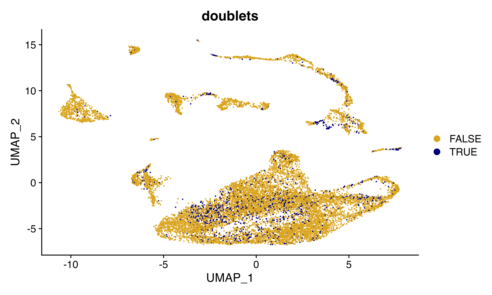

# Quick Start to ScrubletR

## Installing scrubletR

You will need to have the devtools package installed…

``` r

devtools::install_github("furlan-lab/scrubletR")
```

## Load data

``` r

suppressPackageStartupMessages({
  library(viewmastR)
  library(Seurat)
  library(scCustomize)
  library(scrubletR)
})

if(grepl("^gizmo", Sys.info()["nodename"])){
  ROOT_DIR2<-"/fh/fast/furlan_s/grp/data/ddata/BM_data"
} else {
  ROOT_DIR2<-"/Users/sfurlan/Library/CloudStorage/OneDrive-SharedLibraries-FredHutchinsonCancerCenter/Furlan_Lab - General/experiments/patient_marrows/aggr/cds/indy"
}

#query dataset
seuP<-readRDS(file.path(ROOT_DIR2, "220831_WC1.RDS"))
DimPlot_scCustom(seuP, label = F)
```


## Run scrubletR the easy way (compatible with Seurat and monocle3 objects)

``` r

seuP<-scrublet(seuP)

FeaturePlot_scCustom(seuP, features = "doublet_scores")
```


``` r

seuP$doublets<-seuP$doublet_scores > 0.15   #(You pick this)
DimPlot(seuP, group.by = "doublets", cols=c("goldenrod", "navy"))
```



**You can then remove them from your object and re-embed!**

## Appendix

``` r

sessionInfo()
```

    ## R version 4.3.1 (2023-06-16)
    ## Platform: x86_64-apple-darwin20 (64-bit)
    ## Running under: macOS Ventura 13.6.3
    ## 
    ## Matrix products: default
    ## BLAS:   /Library/Frameworks/R.framework/Versions/4.3-x86_64/Resources/lib/libRblas.0.dylib 
    ## LAPACK: /Library/Frameworks/R.framework/Versions/4.3-x86_64/Resources/lib/libRlapack.dylib;  LAPACK version 3.11.0
    ## 
    ## locale:
    ## [1] en_US.UTF-8/en_US.UTF-8/en_US.UTF-8/C/en_US.UTF-8/en_US.UTF-8
    ## 
    ## time zone: America/Los_Angeles
    ## tzcode source: internal
    ## 
    ## attached base packages:
    ## [1] stats     graphics  grDevices utils     datasets  methods   base     
    ## 
    ## other attached packages:
    ## [1] scrubletR_0.2.0    scCustomize_2.0.1  Seurat_5.0.1.9004  SeuratObject_5.0.1
    ## [5] sp_2.1-3           viewmastR_0.2.1   
    ## 
    ## loaded via a namespace (and not attached):
    ##   [1] fs_1.6.3                    matrixStats_1.2.0          
    ##   [3] spatstat.sparse_3.0-3       bitops_1.0-7               
    ##   [5] RcppMsgPack_0.2.3           lubridate_1.9.3            
    ##   [7] httr_1.4.7                  RColorBrewer_1.1-3         
    ##   [9] doParallel_1.0.17           tools_4.3.1                
    ##  [11] sctransform_0.4.1           backports_1.4.1            
    ##  [13] utf8_1.2.4                  R6_2.5.1                   
    ##  [15] lazyeval_0.2.2              uwot_0.1.16                
    ##  [17] GetoptLong_1.0.5            withr_3.0.0                
    ##  [19] gridExtra_2.3               progressr_0.14.0           
    ##  [21] cli_3.6.2                   Biobase_2.60.0             
    ##  [23] textshaping_0.3.7           spatstat.explore_3.2-6     
    ##  [25] fastDummies_1.7.3           labeling_0.4.3             
    ##  [27] prismatic_1.1.1             sass_0.4.8                 
    ##  [29] spatstat.data_3.0-4         ggridges_0.5.6             
    ##  [31] pbapply_1.7-2               pkgdown_2.0.7              
    ##  [33] systemfonts_1.0.5           foreign_0.8-86             
    ##  [35] parallelly_1.36.0           rstudioapi_0.15.0          
    ##  [37] generics_0.1.3              shape_1.4.6                
    ##  [39] ica_1.0-3                   spatstat.random_3.2-2      
    ##  [41] dplyr_1.1.4                 Matrix_1.6-5               
    ##  [43] ggbeeswarm_0.7.2            fansi_1.0.6                
    ##  [45] S4Vectors_0.38.2            abind_1.4-5                
    ##  [47] lifecycle_1.0.4             yaml_2.3.8                 
    ##  [49] snakecase_0.11.1            SummarizedExperiment_1.30.2
    ##  [51] recipes_1.0.9               Rtsne_0.17                 
    ##  [53] paletteer_1.6.0             grid_4.3.1                 
    ##  [55] promises_1.2.1              crayon_1.5.2               
    ##  [57] miniUI_0.1.1.1              lattice_0.22-5             
    ##  [59] cowplot_1.1.3               pillar_1.9.0               
    ##  [61] knitr_1.45                  ComplexHeatmap_2.16.0      
    ##  [63] GenomicRanges_1.52.1        rjson_0.2.21               
    ##  [65] boot_1.3-28.1               future.apply_1.11.1        
    ##  [67] codetools_0.2-19            leiden_0.4.3.1             
    ##  [69] glue_1.7.0                  data.table_1.15.0          
    ##  [71] vctrs_0.6.5                 png_0.1-8                  
    ##  [73] spam_2.10-0                 gtable_0.3.4               
    ##  [75] rematch2_2.1.2              assertthat_0.2.1           
    ##  [77] cachem_1.0.8                gower_1.0.1                
    ##  [79] xfun_0.41                   S4Arrays_1.2.0             
    ##  [81] mime_0.12                   prodlim_2023.08.28         
    ##  [83] survival_3.5-7              timeDate_4032.109          
    ##  [85] SingleCellExperiment_1.22.0 iterators_1.0.14           
    ##  [87] pbmcapply_1.5.1             hardhat_1.3.0              
    ##  [89] lava_1.7.3                  ellipsis_0.3.2             
    ##  [91] fitdistrplus_1.1-11         ROCR_1.0-11                
    ##  [93] ipred_0.9-14                nlme_3.1-164               
    ##  [95] RcppAnnoy_0.0.22            GenomeInfoDb_1.36.4        
    ##  [97] bslib_0.6.1                 irlba_2.3.5.1              
    ##  [99] vipor_0.4.7                 KernSmooth_2.23-22         
    ## [101] rpart_4.1.23                colorspace_2.1-0           
    ## [103] BiocGenerics_0.46.0         Hmisc_5.1-1                
    ## [105] nnet_7.3-19                 ggrastr_1.0.2              
    ## [107] tidyselect_1.2.0            compiler_4.3.1             
    ## [109] htmlTable_2.4.2             desc_1.4.3                 
    ## [111] DelayedArray_0.26.7         plotly_4.10.4              
    ## [113] checkmate_2.3.1             scales_1.3.0               
    ## [115] lmtest_0.9-40               stringr_1.5.1              
    ## [117] digest_0.6.34               goftest_1.2-3              
    ## [119] spatstat.utils_3.0-4        minqa_1.2.6                
    ## [121] rmarkdown_2.25              XVector_0.40.0             
    ## [123] htmltools_0.5.7             pkgconfig_2.0.3            
    ## [125] base64enc_0.1-3             lme4_1.1-35.1              
    ## [127] sparseMatrixStats_1.12.2    MatrixGenerics_1.12.3      
    ## [129] highr_0.10                  fastmap_1.1.1              
    ## [131] rlang_1.1.3                 GlobalOptions_0.1.2        
    ## [133] htmlwidgets_1.6.4           shiny_1.8.0                
    ## [135] DelayedMatrixStats_1.22.6   farver_2.1.1               
    ## [137] jquerylib_0.1.4             zoo_1.8-12                 
    ## [139] jsonlite_1.8.8              ModelMetrics_1.2.2.2       
    ## [141] RCurl_1.98-1.14             magrittr_2.0.3             
    ## [143] Formula_1.2-5               GenomeInfoDbData_1.2.10    
    ## [145] dotCall64_1.1-1             patchwork_1.2.0            
    ## [147] munsell_0.5.0               Rcpp_1.0.12                
    ## [149] reticulate_1.35.0           stringi_1.8.3              
    ## [151] pROC_1.18.5                 zlibbioc_1.46.0            
    ## [153] MASS_7.3-60.0.1             plyr_1.8.9                 
    ## [155] parallel_4.3.1              listenv_0.9.1              
    ## [157] ggrepel_0.9.5               forcats_1.0.0              
    ## [159] deldir_2.0-2                splines_4.3.1              
    ## [161] tensor_1.5                  circlize_0.4.15            
    ## [163] igraph_2.0.1.1              spatstat.geom_3.2-8        
    ## [165] RcppHNSW_0.6.0              reshape2_1.4.4             
    ## [167] stats4_4.3.1                evaluate_0.23              
    ## [169] ggprism_1.0.4               nloptr_2.0.3               
    ## [171] foreach_1.5.2               httpuv_1.6.14              
    ## [173] RANN_2.6.1                  tidyr_1.3.1                
    ## [175] purrr_1.0.2                 polyclip_1.10-6            
    ## [177] future_1.33.1               clue_0.3-65                
    ## [179] scattermore_1.2             ggplot2_3.4.4              
    ## [181] janitor_2.2.0               xtable_1.8-4               
    ## [183] monocle3_1.4.3              RSpectra_0.16-1            
    ## [185] later_1.3.2                 viridisLite_0.4.2          
    ## [187] class_7.3-22                ragg_1.2.7                 
    ## [189] tibble_3.2.1                memoise_2.0.1              
    ## [191] beeswarm_0.4.0              IRanges_2.34.1             
    ## [193] cluster_2.1.6               timechange_0.3.0           
    ## [195] globals_0.16.2              caret_6.0-94
